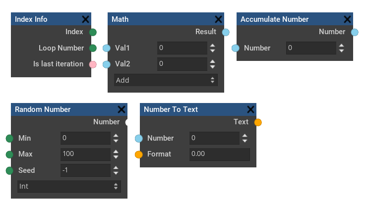
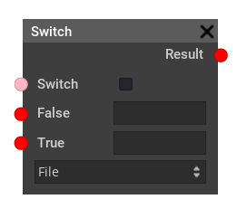

# FNode
## A Nodebased File Management System

This project aims to be a feature rich file management system. FNode can be used to automate repetetive tasks that need to be executed often on a lot of files. Using a flow-graph, you can visually create complex behaviour and execute it on any collection of files and folders.

## Examples

  
*In this example, all Files with the JPG extension would be renamed to the following:*

  
*Critical File operations can bei previewed before actually running the Nodetree.*

## Currently supported operations
The individual nodes functionality is documented in the Software itself (Tooltipps)

## Auto slot conversions

When slots of different Types are connected, the following happens:
- n means the conversion is nonsensical (like turning a date into a file) or not supported yet so it returns an empty value.

| to Slot >  v from Slot |File |Text   |Bool   |Int    |Float   |Date   |List| 
|-|-|-|-|-|-|-|-| 
|File|-|filepath as Text|true if File exists|1 if File exists else 0|1 if File exists else 0|n|n| 
|Text|file at path|-|true if Text not empty|trying to parse to int|trying to parse to float|n|List with 1 Element of given value| 
|Bool|n|false → "false" |-|false -> 0, true -> 1|false -> 0.0, true -> 1.0|n|List with 1 Element of given value| 
|Int|n|125  -> "125"|true if > 0|-|1 -> 1.0|n|List with 1 Element of given value| 
|Float|n|3.2031 -> "3.20"|true if >= 1|rounded int (0.4->0) (0.6->1)|-|n|List with 1 Element of given value| 
|Date|n|30.|a|a|a|-|n| 
|List|n|List -> "[val1, val2...]"|true if List is not empty|List Count|List Count|n|-|

## Why use Godot for UI?
This Project uses Godot for it's UI, but why use Godot over any other C# GUI library?
- Since Godots Editor is also using the UI of the Engine itself, Godot has a very good set of tools for GUI development. Especially drawing and managing Node Editors is very accessible.
- Cross Platform out of the box (in comparison to WPF etc.)

This has the disadvantage of increasing the build size - although not more than for example Electron would. There is also the possibility to exclude unneeded Godot functionality (3D Stuff) from the build with Export Templates, although it's currently not used

## Node ideas:
- Directory Name
- Split Text at... (variable Output Size?? implement text / general Array Sockets???)
- Int to Filesize (KB, MB, GB...)
- random Text (from given List)
- random Number (min, max)
- Delete File (option: to Recycle bin / for good)
- convertion
    - Images: Magick.Net
- zip Files
- Read Text Files
    Options: Whole Text, Only Line X, split at string...
- Image Nodes:
    - Crop (pixels / percent, t l b r)
    - Resize (pixels / percent, option: Keep Aspect)

### Wild Ideas:
- Parse JSON
- Rest API Request
- Create PDFs

### Text Selection Workflow Idea
- add selected property to each character
    - this could be a separate array of ints
    - characters at these positions will be treated as not-selected
- by default, select everything (empty array)
- perform text operation sonly on selected characters

